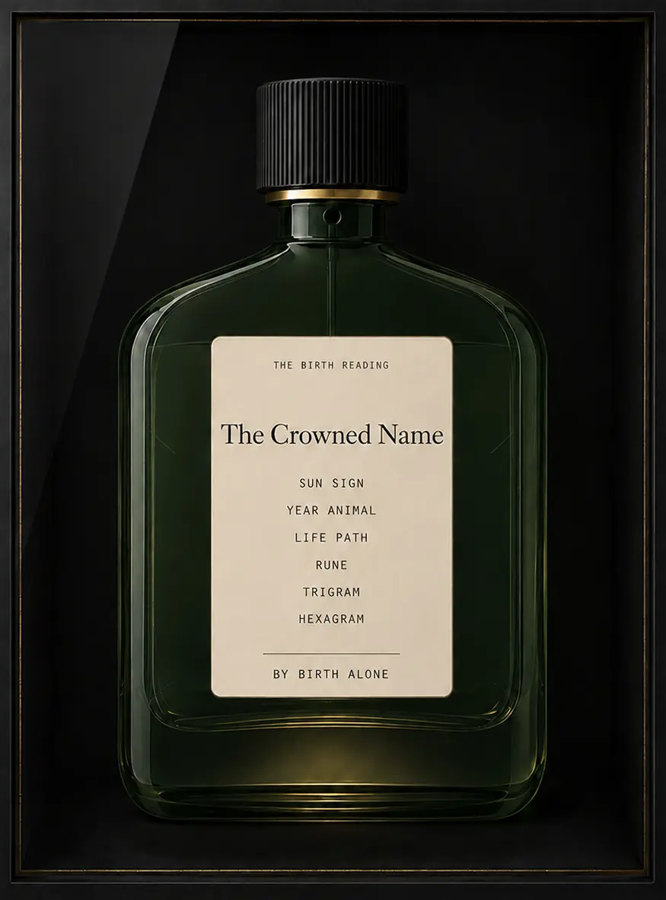
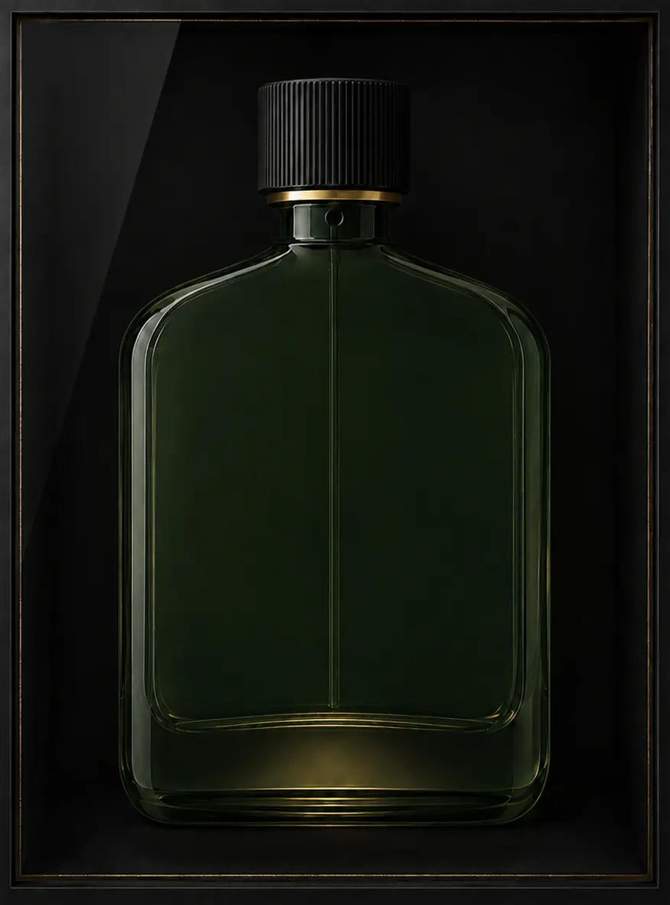

# Birth Accord showcase — Claude handoff

This folder contains a matched pair of the approved Birth Accord cologne showcase.
The Blue Room menu, Birth/Tarot switch, navigation and accessibility remain real HTML
outside the illustration.

## Files

| File | Use |
| --- | --- |
| `birth-accord-showcase-final.png` | Lossless labeled master, 875 × 1182 px, sRGB |
| `birth-accord-showcase-final.webp` | Lightweight labeled web derivative |
| `birth-accord-showcase-no-sticker.png` | Lossless clean-glass master, 875 × 1182 px, sRGB |
| `birth-accord-showcase-no-sticker.webp` | Lightweight clean-glass web derivative |
| `asset.json` | Canvas, variant intent, display sizes and interaction regions |
| `CHECKSUMS.sha256` | Integrity hashes for the four image assets |

Both variants are opaque, tightly cropped rectangles with identical dimensions. They
can be swapped or crossfaded without a layout shift. Do not key, mask or independently
stretch either axis.

## Choose the variant

- Use **`final`** when the parchment reading is part of the illustration. Do not duplicate
  its card copy in HTML.
- Use **`no-sticker`** when the existing real menu card must keep its hover, click, flip,
  focus and keyboard systems. Mount that unchanged card over the `card` region recorded
  in `asset.json`.

## Static labeled placement

```html
<figure class="birth-accord-showcase">
  
</figure>
```

## Live-card placement

```html
<figure class="birth-accord-showcase birth-accord-showcase--live">
  

  <div class="birth-accord-showcase__card">
    <!-- Move the existing real Birth card node here; do not clone it. -->
  </div>
</figure>
```

```css
.birth-accord-showcase {
  position: relative;
  width: min(464px, 100%);
  margin: 0 auto;
}

.birth-accord-showcase > img {
  display: block;
  width: 100%;
  height: auto;
  aspect-ratio: 875 / 1182;
  pointer-events: none;
  user-select: none;
}

.birth-accord-showcase__card {
  position: absolute;
  left: 31.54%;
  top: 37.40%;
  width: 36.34%;
  height: 39.93%;
  transform-origin: 50% 50%;
}
```

At a 1672 × 940 desktop viewport, start around **430–464 px wide**. On narrow
screens, use `width: min(390px, calc(100vw - 20px))`.

## Interaction guidance

- The no-sticker image is a passive stage. Keep it `pointer-events: none`; the real card
  receives input above it.
- Reparent the existing card if necessary; do not duplicate its content or event identity.
- Keep the existing Birth/Tarot control below the showcase as a real radiogroup/button UI.
- For bottle response, use a restrained wrapper `translateY`, scale, opacity or separate
  glint layer. Do not freeform-warp the illustration.
- Respect `prefers-reduced-motion`, preserve focus visibility and leave all navigation
  outside the image.
- Do not modify the original left/right menu columns to accommodate the asset.

## Visual invariants

Preserve the smoked botanical-green glass, low broad fragrance shoulders, ribbed black
cap, restrained brass collar, atomizer aperture, straight dip tube, illuminated heavy
base, single diagonal vitrine reflection and brass hairline. The `no-sticker` variant must
remain clean continuous glass. Avoid jar, medicine, food-preserve, whisky or other beverage
cues.
